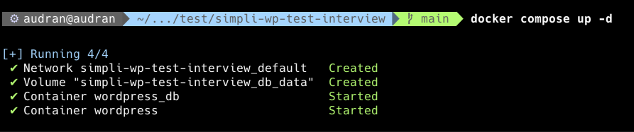
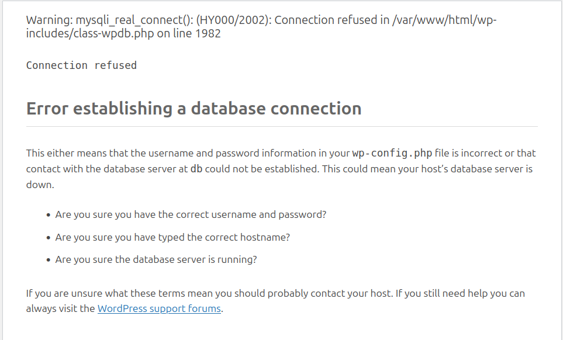
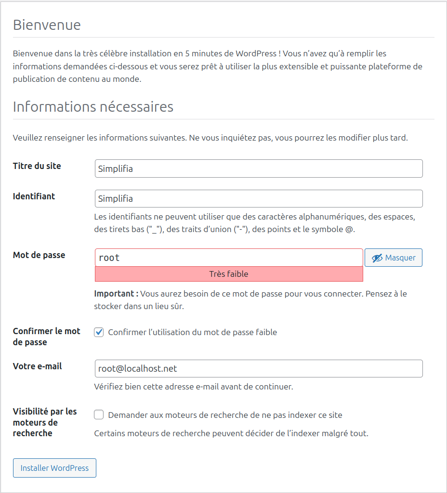
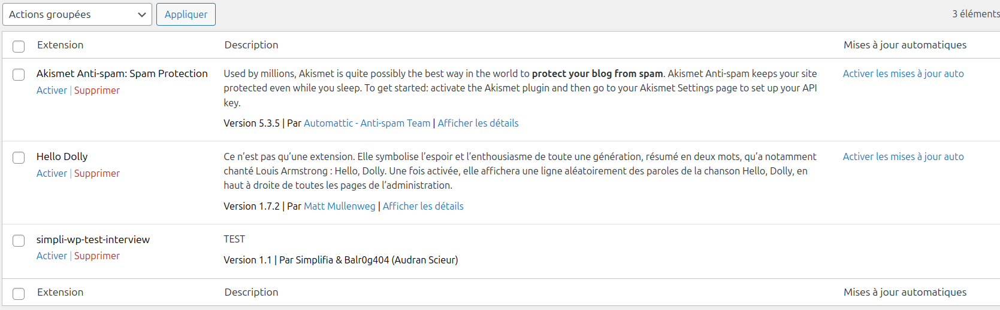
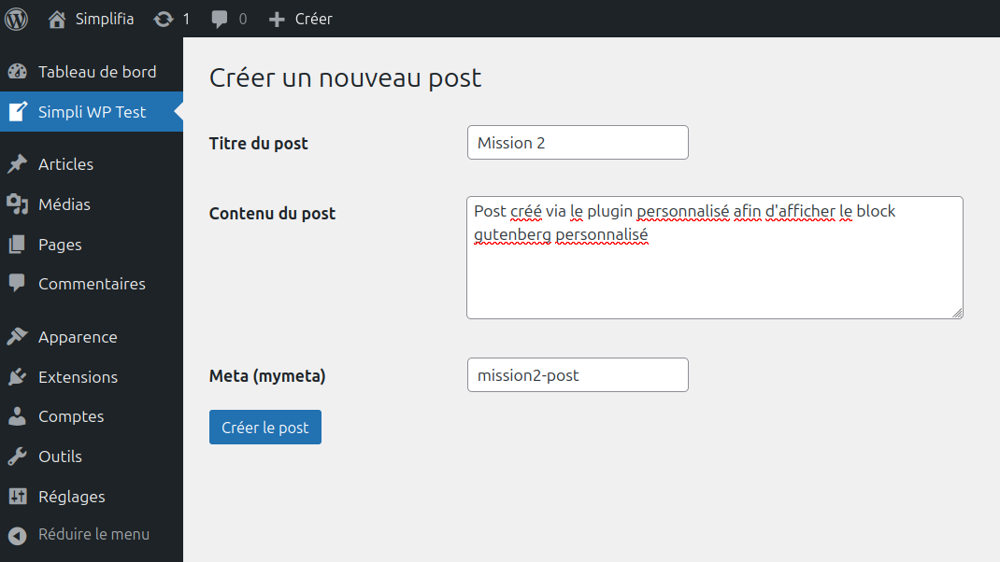
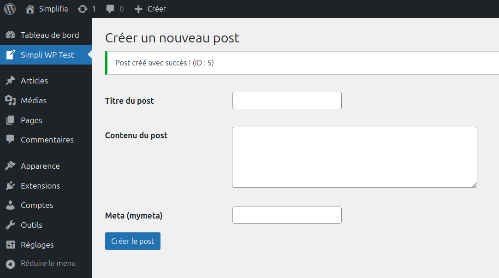
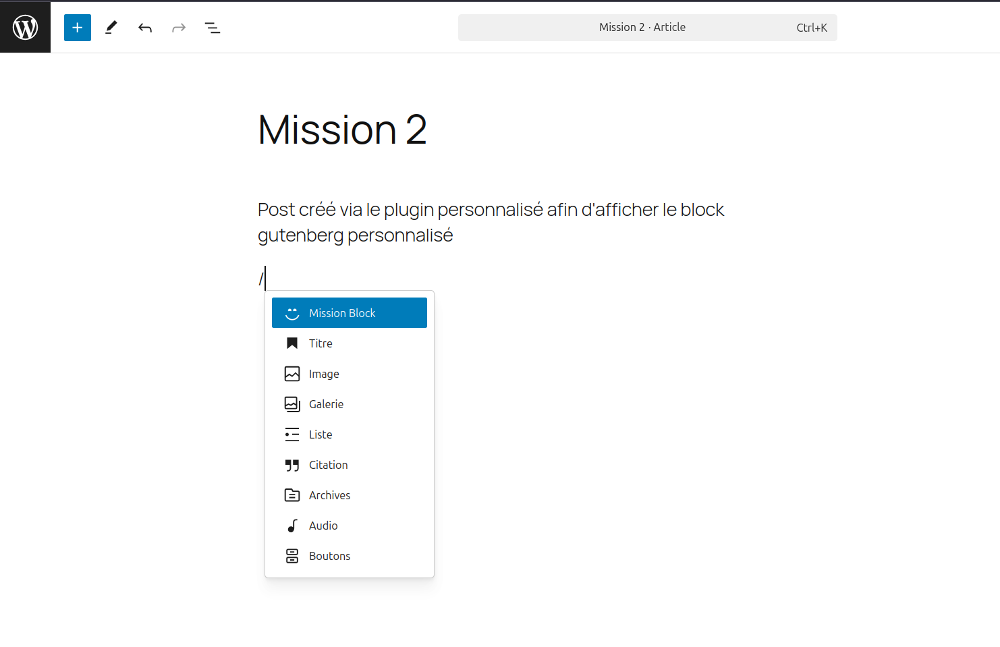
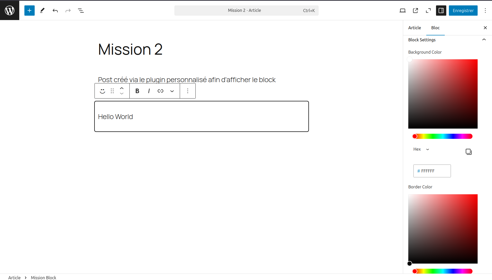
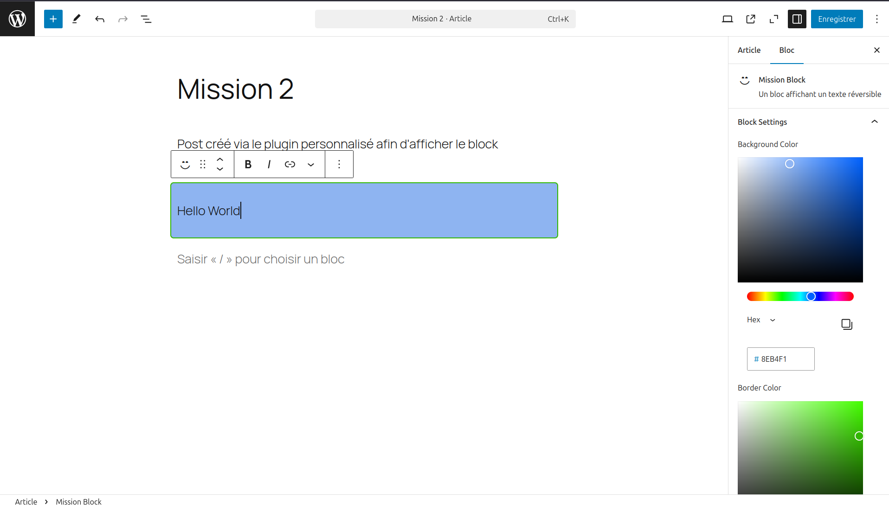
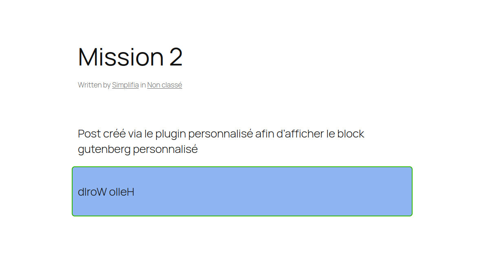

# simpli-wp-test-interview

Voici ma proposition d'implémentation du test technique proposé par Simplifia.

## Initialisation
Pour plus de simplicité, j'ai ajouté docker afin de pouvoir tester aisément les modifications apportées. 

Une fois docker installé, il suffit de lancer : 
```bash
docker compose up -d
```

à la racine du projet.


Si cette erreur apparait : 


C'est que le conteneur Wordpress a essayé de se connecter à la base de donnée avant que le container MySQL n'ai eu le temps de charger.
Il suffit de faire : 
```bash
docker restart wordpress
```

Pour résoudre le problème et arriver sur la célèbre installation en 5 minutes de Wordpress.


Une fois connecté, il est nécessaire d'activer manuellement l'extension.


## Mission 1

Une fois activée, un onglet apparait en dessous du "tableau de bord" dans le menu latéral. 
Celui-ci permet d'ajouter un post : 



## Mission 2

En nous rendant sur le post nouvellement créé, nous pouvons ajouter le nouveau block "Mission Block" de manière classique.


Celui-ci affiche un texte avec une bordure. Le texte par défaut est Hello World mais peut-être modifié dans l'éditeur.
De plus, le panneau de configuration permet de modifier la couleur du background ainsi que de la bordure.




Une fois le post enregisté, nous pouvons l'afficher sur la partie front-end, où un click sur le block va inverser le texte.


